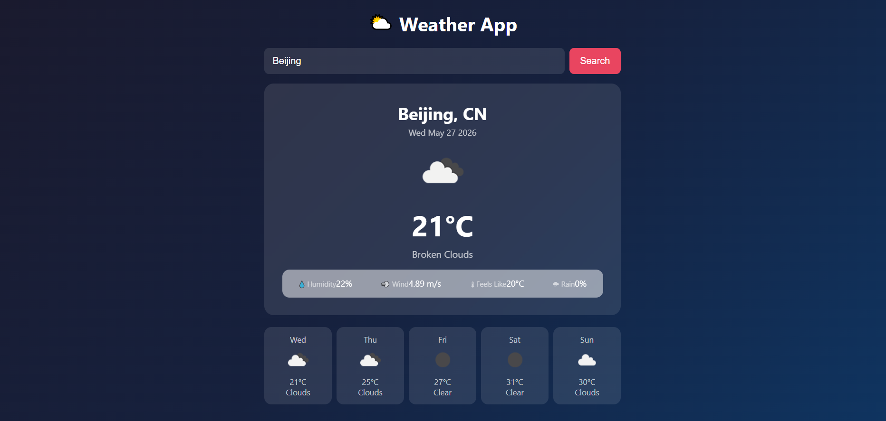
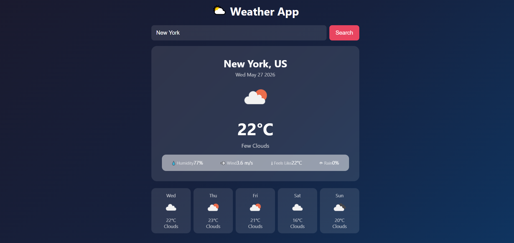

# ⛅ Weather App

A clean, responsive weather application built with vanilla HTML, CSS, and JavaScript. Search any city in the world and get real-time weather conditions and a 5-day forecast — powered by the OpenWeatherMap API.


---

## 🌍 Live Demo

[View Live Site](https://geomn99.github.io/WeatherApp/)

---

## 📸 Screenshots





---

## ✨ Features

- 🔍 Search weather by city name
- 🌡 Current temperature, feels like, humidity, and wind speed
- 🌧 Rain probability for today and each forecast day
- 📅 5-day weather forecast
- 💾 Remembers your last searched city using localStorage
- ⚠️ Error handling for invalid city names
- 📱 Fully responsive — optimized for mobile and desktop

---

## 🛠 Built With

- HTML5
- CSS3
- JavaScript
- [OpenWeatherMap API](https://openweathermap.org/api)

---

## 🚀 Getting Started

### Prerequisites
- A free API key from [OpenWeatherMap](https://openweathermap.org)

### Installation

1. Clone the repository:
   ```bash
   git clone https://github.com/geomn99/WeatherApp.git
   ```

2. Navigate into the project folder:
   ```bash
   cd WeatherApp
   ```

3. Open `script.js` and replace the API key with your own:
   ```javascript
   const API_KEY = 'YOUR_API_KEY_HERE';
   ```

4. Open `index.html` in your browser and start searching!

---

## 📁 Project Structure

```
Weather-App/
├── index.html
├── style.css
├── script.js
└── README.md
```

---

## 🙏 Acknowledgements

- Weather data provided by [OpenWeatherMap](https://openweathermap.org)
- Built as part of my junior developer portfolio

---

## 👨‍💻 Author

**George** — [@geomn99](https://github.com/geomn99)

---

## 📄 License

This project is licensed under the [Apache License 2.0](LICENSE).

Copyright 2026 George

Licensed under the Apache License, Version 2.0 (the "License");
you may not use this file except in compliance with the License.
You may obtain a copy of the License at

    http://www.apache.org/licenses/LICENSE-2.0

Unless required by applicable law or agreed to in writing, software
distributed under the License is distributed on an "AS IS" BASIS,
WITHOUT WARRANTIES OR CONDITIONS OF ANY KIND, either express or implied.
See the License for the specific language governing permissions and
limitations under the License.